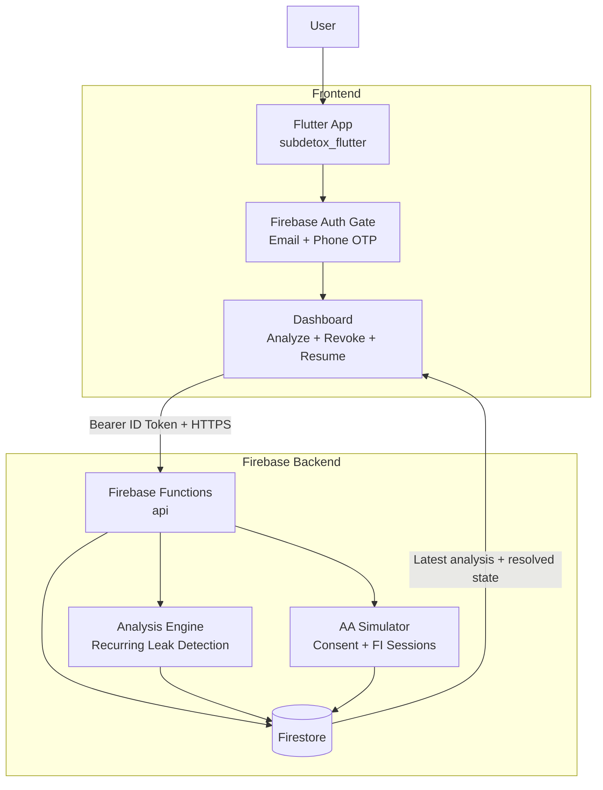

# SubDetox

SubDetox is an AI-powered financial auditor that detects recurring wealth leakage from subscriptions, auto-debits, and telecom VAS charges.

## What SubDetox Shows

- Auth-gated onboarding with Firebase Auth
- AI-style recurring debit detection from mocked AA transaction payloads
- Risk-tiered dashboard (high, medium, low) with confidence and reasoning
- Revoke flow that calls backend during modal execution
- Persisted state so previous analysis and resolved subscriptions restore on next login

## Architecture



## Repository Structure

```text
sub-detox/
  app/                          # Legacy FastAPI prototype path
  functions/                    # Firebase Functions backend
    src/
      index.js
      auth.js
      mockAaData.js
      analysisEngine.js
      aaSimulator.js
  subdetox_flutter/             # Flutter app (active frontend)
    lib/
      providers/
      screens/
      services/
      widgets/
      main.dart

  firebase.json
  .firebaserc
  firestore.rules
  firestore.indexes.json
  .env.example
  self-testing-guide.md
  usage-guide.md
```

## Quick Start (Local Demo)

### 1) Install dependencies

```powershell
cd C:\Users\Amaan\Downloads\sub-detox
npm --prefix functions install
cd C:\Users\Amaan\Downloads\sub-detox\subdetox_flutter
flutter pub get
```

### 2) Start Firebase emulators

```powershell
cd C:\Users\Amaan\Downloads\sub-detox
npx -y firebase-tools@latest emulators:start --only auth,firestore,functions --project subdetox-20260412-8514
```

### 3) Run Flutter app

Open a second terminal:

```powershell
cd C:\Users\Amaan\Downloads\sub-detox\subdetox_flutter
flutter run --dart-define=FIREBASE_USE_EMULATOR=true
```

## Firebase API Routes (Functions)

Base emulator URL:

`http://127.0.0.1:5001/subdetox-20260412-8514/asia-south1/api`

Implemented routes:

- `GET /health`
- `GET /me` (auth required)
- `GET /mock-aa-data` (auth required)
- `POST /analyze-transactions` (auth required)
- `GET /analysis/latest` (auth required)
- `POST /revoke-mandate` (auth required)
- `POST /simulator/consents` (auth required)
- `GET /simulator/consents/:consentId` (auth required)
- `POST /simulator/consents/:consentId/revoke` (auth required)
- `POST /simulator/fi-sessions` (auth required)
- `GET /simulator/fi-sessions/:sessionId` (auth required)

## Demo Notes

- The Flutter app is emulator-ready by default when `FIREBASE_USE_EMULATOR=true`.
- Cloud Functions deployment needs Blaze billing on Firebase.
- Phone OTP is available in code path, but email sign-in is recommended for quickest live demo.

## Documentation

- [self-testing-guide.md](self-testing-guide.md) for full validation and regression checks
- [usage-guide.md](usage-guide.md) for a presenter-friendly hackathon demo script
