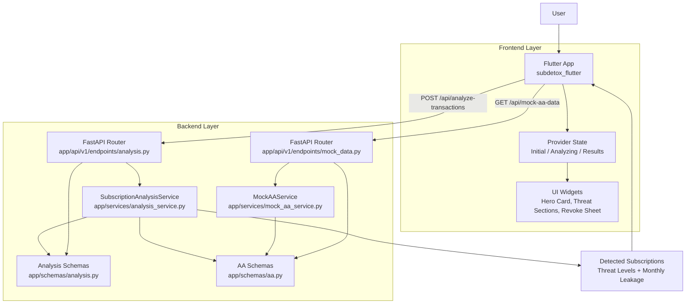

# SubDetox (Full-Stack Prototype)

SubDetox is an AI-powered financial auditor that detects silent wealth leakage from recurring subscriptions, auto-debits, and telecom VAS charges.

This repository contains:

- A modular FastAPI backend for mock Account Aggregator data generation and transaction analysis
- A premium Flutter mobile frontend that consumes the analysis API and drives revoke flows

## Architecture



## Repository Structure

```text
sub-detox/
  app/                          # FastAPI backend
    api/
      router.py
      v1/endpoints/
        analysis.py
        mock_data.py
    core/
      settings.py
    schemas/
      aa.py
      analysis.py
    services/
      mock_aa_service.py
      analysis_service.py
    main.py

  subdetox_flutter/             # Flutter mobile frontend
    lib/
      models/
      providers/
      screens/
      services/
      theme/
      widgets/
      main.dart
    pubspec.yaml

  requirements.txt              # Python dependencies
  self-testing-guide.md         # End-to-end manual QA guide
```

## Tech Stack

| Layer | Stack |
|---|---|
| Backend API | FastAPI, Pydantic |
| Backend Logic | Rule-based analysis engine, mock AA data generator |
| Frontend | Flutter, Provider |
| Networking | http package |
| UI | google_fonts, lucide_icons |

## Quick Start

### 1) Backend Setup and Run

```powershell
cd C:\Users\Amaan\Downloads\sub-detox
python -m venv .venv
.\.venv\Scripts\Activate.ps1
pip install -r requirements.txt
uvicorn app.main:app --reload
```

Backend will run at: `http://127.0.0.1:8000`

### 2) Frontend Setup and Run

Open a second terminal:

```powershell
cd C:\Users\Amaan\Downloads\sub-detox\subdetox_flutter
flutter pub get
flutter run
```

## API Endpoints

| Method | Route | Purpose |
|---|---|---|
| GET | /health | Service health check |
| GET | /api/mock-aa-data/ | Returns nested mock Account Aggregator payload |
| POST | /api/analyze-transactions/ | Runs recurring subscription detection engine |

### Example Analyze Call

```powershell
Invoke-RestMethod -Uri "http://127.0.0.1:8000/api/analyze-transactions/" -Method Post -ContentType "application/json" -Body "{}"
```

## Frontend Behavior

- Dashboard state machine:
  - Initial
  - Analyzing
  - Results
- Results UX:
  - Animated monthly leakage hero amount
  - Scan confidence progress card
  - Threat-based grouping (High, Medium, Low)
  - Expandable reasoning for each detected subscription
  - Revoke mandate modal sequence with staged progress

## Testing

For complete API + UI validation scenarios, use:

- [self-testing-guide.md](self-testing-guide.md)

This includes smoke tests, UI pass criteria, revoke flow checks, and regression checklist.

## Notes

- Flutter host mapping is platform-aware:
  - Android emulator -> `10.0.2.2`
  - iOS simulator/desktop/web -> `127.0.0.1`
- If testing on a physical phone, update frontend API host to your machine LAN IP.
