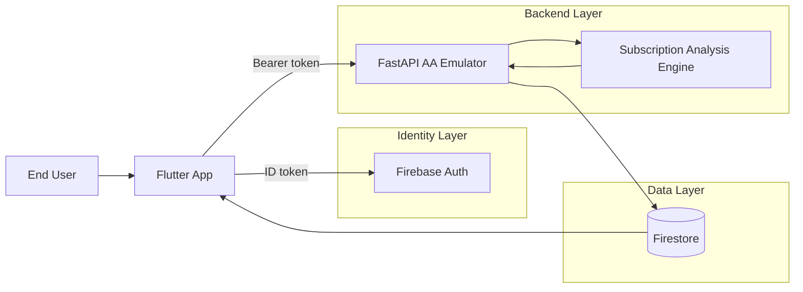
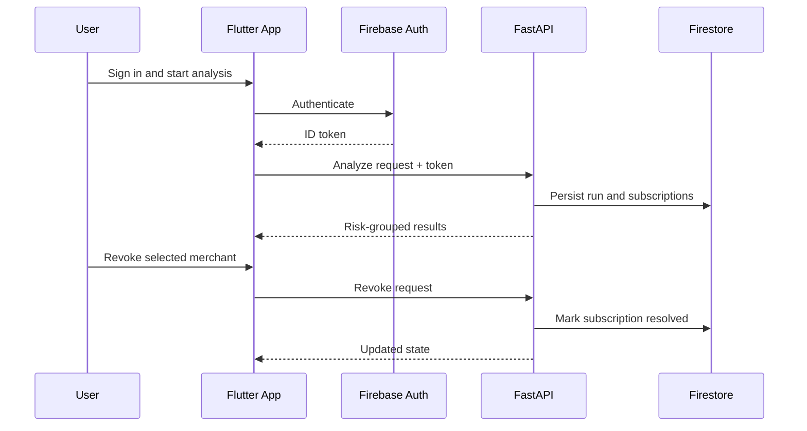

# SubDetox

**The AI-Powered Subscription & Autopay Detox Agent**

Stop the silent wealth drain. Take back control of your money — with one click.

> Built by **Team Redline** — Amaan Syed & Chaitanya

🌐 **Landing Page:** [subdetox.vercel.app](https://subdetox.vercel.app/)

---

## Download Android APK

- [**Download SubDetox Android APK**](https://raw.githubusercontent.com/amaansyed27/sub-detox/main/android-apk/subdetox-android.apk)
- [View all releases (optional)](https://github.com/amaansyed27/sub-detox/releases)

> The APK is stored at `android-apk/subdetox-android.apk`. Replace this file when publishing a new build to keep the same download link working.

---

## ⚠️ Simulation Disclaimer — RBI Account Aggregator & FIU Setu

**This demo uses a simulated API layer.** Live government and banking rails need formal approvals, partner onboarding, strict security audits, and compliance permissions. We mirror real payloads and flows safely while proving the complete product experience.

### What is the RBI Account Aggregator (AA) Framework?

The [Account Aggregator](https://sahamati.org.in/) framework is India's RBI-regulated, consent-based financial data-sharing ecosystem. It enables users to securely share their financial data between institutions without intermediary storage:

| Component | Role |
|---|---|
| **Account Aggregator (AA)** | RBI-licensed consent manager. Routes encrypted data between FIPs and FIUs without storing or reading the data. |
| **Financial Information Provider (FIP)** | Banks, mutual funds, insurance companies, and pension funds — the data holders. |
| **Financial Information User (FIU)** | Regulated entities that consume data to provide services (lending, wealth management, auditing). |
| **Technical Service Provider (TSP)** | Companies like **Setu** and Perfios that provide the API infrastructure FIUs and FIPs use to integrate with the AA network. |

### What SubDetox Simulates

SubDetox functions as an **FIU** (Financial Information User) within this ecosystem. In production, it would:

1. Register as an FIU via a TSP like **Setu** on the [Sahamati](https://sahamati.org.in/) central registry
2. Request **consent** from the user through a certified Account Aggregator
3. Receive **encrypted financial data** (bank statements, UPI mandates) via AA data-fetch APIs
4. Analyze transactions using its rules engine + Gemini AI enrichment
5. Surface actionable revocation recommendations

**In this hackathon build**, SubDetox fully emulates this lifecycle:

- **Consent flow:** Mirrors the AA consent-request → user-approve → consent-granted lifecycle with realistic payloads and status transitions
- **FI Session emulation:** Simulates FIP data-fetch sessions with proper session IDs, status callbacks, and encrypted-payload structures matching the [ReBIT AA API spec](https://api.rebit.org.in/)
- **Account discovery:** Emulates the `/account-availability` and `/account-selection` flows that FIUs use to discover linked accounts
- **Transaction data:** Uses structured synthetic bank statements that match real AA FI data schemas (deposit accounts, recurring transactions, mandate references)
- **End-to-end security model:** All API calls require Firebase Auth bearer tokens, mirroring the token-based auth that production AA integrations mandate

### Why Simulation?

Going live on the AA network requires:

- **RBI FIU registration** — Formal licensing as a regulated entity under RBI, SEBI, IRDAI, or PFRDA
- **Sahamati certification** — All participants (AA, FIP, FIU) must pass interoperability and security certification managed by [Sahamati](https://sahamati.org.in/)
- **TSP onboarding** — Integration with a Technical Service Provider (like Setu) requires enterprise agreements, sandbox → production migration, and request-signing key exchange
- **Security audits** — Mandatory security assessments covering data encryption, consent lifecycle compliance, and CERT-In reporting
- **Partner bank approvals** — FIPs must individually approve data-sharing with each FIU

SubDetox's simulation layer proves the **complete product experience** — from consent to analysis to revocation — while staying fully compliant with hackathon constraints. The architecture is designed for a direct swap to production AA/Setu APIs when formal approvals are obtained.

---

## Core Features

- Secure sign-up and sign-in with Firebase Auth
- AI-driven recurring charge detection from account transaction data
- Deterministic rules-engine scoring with confidence and threat levels
- Gemini API enrichment for semantic anomaly detection and agentic chat guidance
- Risk-prioritized subscription cards with reasoning explanations
- In-flow mandate revoke simulation with persisted resolution state
- Resume latest analysis on next login without re-running from scratch
- AA-style consent and FI session lifecycle emulation for realistic sandbox behavior

## Architecture

SubDetox is built as a hybrid platform:

- **Flutter app** for user experience and stateful dashboard flows
- **FastAPI service** for AA-style orchestration, analysis, and revoke APIs
- **Firebase** for identity and persistent storage
- **Cloud Run** for managed backend runtime

### Runtime Flow

## Tech Stack

| Layer | Technologies |
|---|---|
| **Frontend** | Flutter, Dart, Provider |
| **Backend API** | Python, FastAPI, Uvicorn, Pydantic |
| **AI / ML** | Gemini API (enrichment, anomaly detection, agentic chat) |
| **Rules Engine** | Deterministic scoring with confidence & threat levels |
| **Auth & Data** | Firebase Auth, Firestore, Firebase Admin SDK |
| **Deployment** | Cloud Run, Cloud Build, Container Registry (gcr.io) |
| **Validation** | pytest, PowerShell smoke scripts, Flutter analyzer |

## API Design

The backend exposes two complementary API surfaces:

- **AA-style v2 simulator APIs** for consent / session / FIP / account-availability lifecycles
- **App-compat APIs** used by the Flutter app flow:
  - Onboarding and account selection: `/api/me`, `/api/v2/account-availability`, `/api/v2/account-selection`
  - Dashboard analysis and actions: `/api/analyze-transactions`, `/api/analysis/latest`, `/api/revoke-mandate`

## Repository Layout

| Path | Purpose |
|---|---|
| `app/` | FastAPI app (routes, services, schemas, dependencies) |
| `subdetox_flutter/` | Flutter mobile application |
| `web-landing/` | Vite + React landing page ([subdetox.vercel.app](https://subdetox.vercel.app/)) |
| `android-apk/` | Pre-built APK for direct download |
| `tests/` | Python integration tests for v2 and app-compat flows |
| `scripts/` | Automated and manual verification scripts |
| `functions/` | Legacy Firebase Functions path (fallback compatibility) |

## Documentation

- [usage-guide.md](usage-guide.md) — End-user usage and full feature testing
- [self-testing-guide.md](self-testing-guide.md) — Engineering QA runbook
- [cloud-run-deploy-guide.md](cloud-run-deploy-guide.md) — Deployment guide
- [rules-engine-working.md](rules-engine-working.md) — Detailed rules/AI flow design with Mermaid architecture chart

## Landing Page

The landing page is deployed at **[subdetox.vercel.app](https://subdetox.vercel.app/)** and includes:

- Animated interactive hero with cursor-responsive parallax SVG art
- Problem statement, scale statistics, and solution overview
- Step-by-step "How It Works" flow
- Impact metrics and target audience breakdown
- Tech stack pyramid visualization
- Team section and demo video walkthrough
- APK download and pitch deck (PDF) download

Source: [`web-landing/`](web-landing/)

---

**Team Redline** · Amaan Syed & Chaitanya
