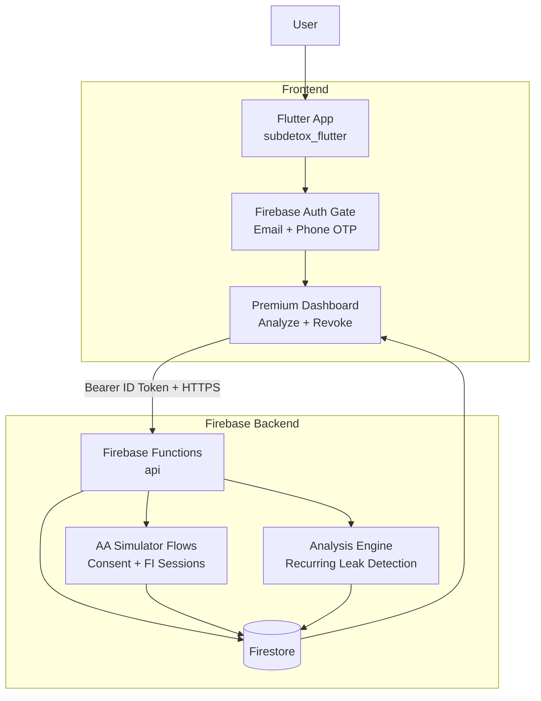

# SubDetox (Firebase Implementation In Progress)

SubDetox is an AI-powered financial auditor that detects recurring wealth leakage from subscriptions, auto-debits, and telecom VAS charges.

The codebase is currently transitioning from a local FastAPI prototype to a Firebase-native backend.

## Current Status

- Firebase project created and linked: `subdetox-20260412-8514`
- Firestore database provisioned with deployed rules and indexes
- Firebase Auth email/password provider enabled via CLI
- Firebase Functions API implemented with authenticated routes
- Flutter app now uses Firebase Auth gate and bearer-authenticated API calls
- Revoke state now persists and is restored on fresh analysis reloads

## Architecture (Current)



## Repository Structure

```text
sub-detox/
  app/                          # Existing FastAPI prototype (legacy path)
  functions/                    # Firebase Functions backend
    src/
      index.js
      auth.js
      mockAaData.js
      analysisEngine.js
      aaSimulator.js
  subdetox_flutter/             # Flutter app (active frontend)
    lib/
      providers/
      screens/
      services/
      widgets/
      main.dart

  firebase.json
  .firebaserc
  firestore.rules
  firestore.indexes.json
  .env.example
  self-testing-guide.md
```

## Quick Start (Firebase Path)

### 1) Install Function Dependencies

```powershell
cd C:\Users\Amaan\Downloads\sub-detox
npm --prefix functions install
```

### 2) Start Firebase Emulators

```powershell
cd C:\Users\Amaan\Downloads\sub-detox
npx -y firebase-tools@latest emulators:start --only auth,firestore,functions --project subdetox-20260412-8514
```

### 3) Run Flutter App

Open a second terminal:

```powershell
cd C:\Users\Amaan\Downloads\sub-detox\subdetox_flutter
flutter pub get
flutter run --dart-define=FIREBASE_USE_EMULATOR=true
```

## Firebase API Routes (Functions)

Base (emulator):

`http://127.0.0.1:5001/subdetox-20260412-8514/asia-south1/api`

Implemented routes:

- `GET /health`
- `GET /me` (auth required)
- `GET /mock-aa-data` (auth required)
- `POST /analyze-transactions` (auth required)
- `POST /revoke-mandate` (auth required)
- `POST /simulator/consents` (auth required)
- `GET /simulator/consents/:consentId` (auth required)
- `POST /simulator/consents/:consentId/revoke` (auth required)
- `POST /simulator/fi-sessions` (auth required)
- `GET /simulator/fi-sessions/:sessionId` (auth required)

## Important Notes

- Functions emulator currently runs locally and is wired by default in Flutter.
- Cloud deployment of Functions requires billing (Blaze) on the Firebase project.
- Firestore and Auth provisioning were completed through CLI and are active.
- Phone OTP in production requires provider setup and verified testing numbers strategy.

## Testing

Use the full test flow in:

- [self-testing-guide.md](self-testing-guide.md)
