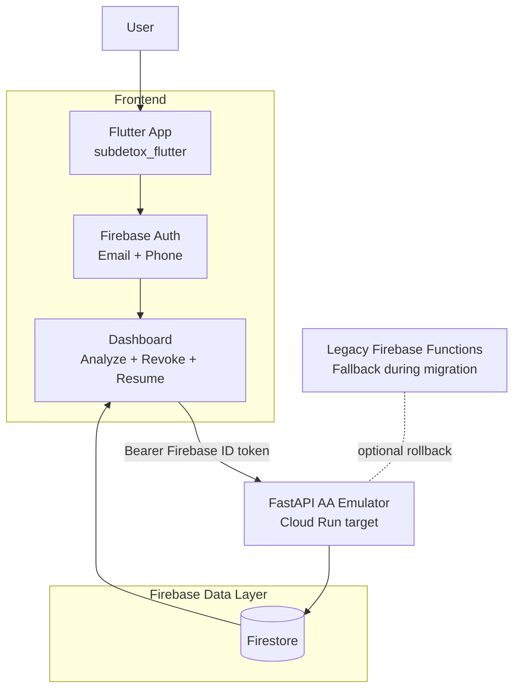

# SubDetox

SubDetox is an AI-powered financial auditor for recurring wealth leakage (subscriptions, silent auto-debits, telecom VAS).

This codebase now follows a hybrid architecture:

- Firebase is used for authentication, storage, and persistence.
- Python FastAPI is the primary app-facing API and AA-style emulator runtime (Cloud Run target).

## Current Architecture



## API Surfaces

Primary AA-style v2 emulator APIs:

- `POST /v2/account-availability`
- `GET /v2/fips`
- `GET /v2/fips/:id`
- `POST /v2/consents`
- `GET /v2/consents/:id`
- `POST /v2/consents/:id/revoke`
- `GET /v2/consents/:id/fetch/status`
- `GET /v2/consents/:id/data-sessions`
- `POST /v2/consents/collection`
- `POST /v2/sessions`
- `GET /v2/sessions/:id`
- `GET /v2/consents/webview/:id` (hosted-like consent page)
- `POST /v2/simulator/consents/:id/action`
- `GET /v2/notifications/events`

App-compat APIs retained for Flutter continuity:

- `GET /api/me`
- `GET /api/mock-aa-data`
- `POST /api/analyze-transactions`
- `GET /api/analysis/latest`
- `POST /api/revoke-mandate`

## Local Development

### 1) Install dependencies

```powershell
cd C:\Users\Amaan\Downloads\sub-detox
c:/Users/Amaan/Downloads/sub-detox/.venv/Scripts/python.exe -m pip install -r requirements.txt
cd C:\Users\Amaan\Downloads\sub-detox\subdetox_flutter
flutter pub get
```

### 2) Start Firebase emulators for auth and Firestore

```powershell
cd C:\Users\Amaan\Downloads\sub-detox
npx -y firebase-tools@latest emulators:start --only auth,firestore --project subdetox-20260412-8514
```

### 3) Start FastAPI locally

```powershell
cd C:\Users\Amaan\Downloads\sub-detox
$env:USE_FIRESTORE_EMULATOR='true'
$env:FIRESTORE_EMULATOR_HOST='127.0.0.1:8081'
c:/Users/Amaan/Downloads/sub-detox/.venv/Scripts/python.exe -m uvicorn app.main:app --host 127.0.0.1 --port 8000
```

### 4) Run Flutter against local FastAPI

```powershell
cd C:\Users\Amaan\Downloads\sub-detox\subdetox_flutter
flutter run --dart-define=BACKEND_MODE=fastapi-local --dart-define=FASTAPI_LOCAL_PORT=8000 --dart-define=FIREBASE_USE_EMULATOR=true
```

For physical device local testing, also pass `--dart-define=LOCAL_API_HOST=<LAN_IP_OF_YOUR_PC>`.

## Testing

Automated checks:

```powershell
powershell -ExecutionPolicy Bypass -File C:\Users\Amaan\Downloads\sub-detox\scripts\run_automated_tests.ps1
```

Manual API smoke:

```powershell
powershell -ExecutionPolicy Bypass -File C:\Users\Amaan\Downloads\sub-detox\scripts\manual_api_smoke.ps1
```

## Deployment

Cloud Run deployment steps are documented in [cloud-run-deploy-guide.md](cloud-run-deploy-guide.md).

## Documentation

- [self-testing-guide.md](self-testing-guide.md)
- [usage-guide.md](usage-guide.md)
- [cloud-run-deploy-guide.md](cloud-run-deploy-guide.md)
