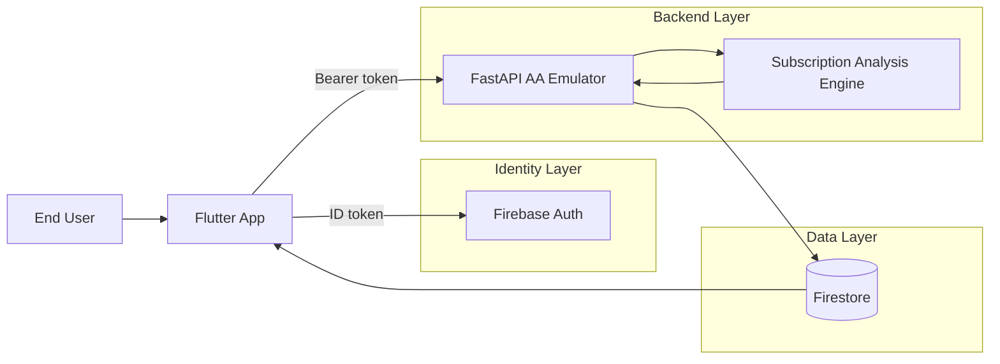
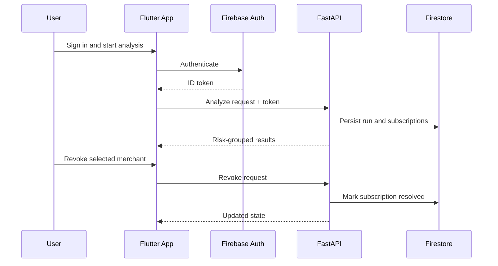

# SubDetox

SubDetox helps users detect and stop recurring financial leakage from subscriptions, silent auto-debits, and low-visibility mandate charges.

## Core Features

- Secure sign-up and sign-in with Firebase Auth.
- AI-driven recurring charge detection from account transaction data.
- Risk-prioritized subscription cards with confidence and reasoning.
- In-flow mandate revoke simulation with persisted resolution state.
- Resume latest analysis on next login without re-running from scratch.
- AA-style consent and FI session lifecycle emulation for realistic sandbox behavior.

## Architecture

SubDetox is built as a hybrid platform:

- Flutter app for user experience and stateful dashboard flows.
- FastAPI service for AA-style orchestration, analysis, and revoke APIs.
- Firebase for identity and persistent storage.
- Cloud Run for managed backend runtime.

### Runtime Flow

## Tech Stack

- Frontend: Flutter, Dart, Provider.
- Backend API: Python, FastAPI, Uvicorn, Pydantic.
- Auth and Data: Firebase Auth, Firestore, Firebase Admin SDK.
- Deployment: Cloud Run, Cloud Build, Container Registry (gcr.io).
- Validation: pytest, PowerShell smoke scripts, Flutter analyzer.

## API Design

The backend exposes two complementary API surfaces:

- AA-style v2 simulator APIs for consent/session/FIP/account-availability lifecycles.
- App-compat APIs used by the Flutter app flow:
  - onboarding and account selection: `/api/me`, `/api/v2/account-availability`, `/api/v2/account-selection`
  - dashboard analysis and actions: `/api/analyze-transactions`, `/api/analysis/latest`, `/api/revoke-mandate`

## Repository Layout

- `app/`: FastAPI app (routes, services, schemas, dependencies).
- `subdetox_flutter/`: Flutter application.
- `tests/`: Python integration tests for v2 and app-compat flows.
- `scripts/`: Automated and manual verification scripts.
- `functions/`: Legacy Firebase Functions path kept for fallback compatibility.

## Documentation

- [usage-guide.md](usage-guide.md) - end-user usage and full feature testing.
- [self-testing-guide.md](self-testing-guide.md) - engineering QA runbook.
- [cloud-run-deploy-guide.md](cloud-run-deploy-guide.md) - deployment guide.
- [rules-engine-working.md](rules-engine-working.md) - detailed rules/AI flow design with Mermaid architecture chart.
