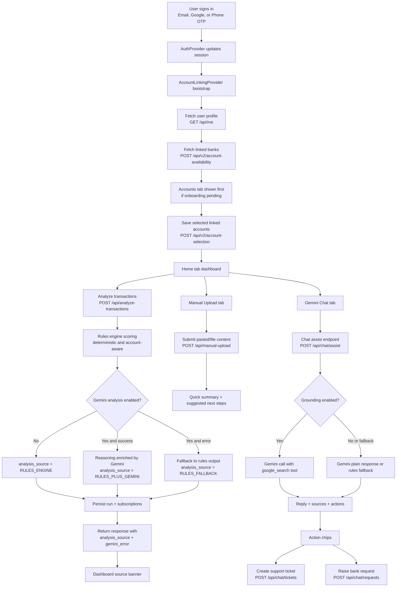

# Rules Engine Working

This document explains how the SubDetox platform currently works end to end, including account linking, manual upload, rules-first analysis, optional Gemini enrichment, and the new in-app chat and support workflows.

## 1) System Goals

SubDetox is designed with three practical goals:

1. Keep core subscription detection deterministic and stable across repeated demo runs.
2. Add AI capabilities without making the app fail if Gemini is unavailable.
3. Give users actionable controls (account selection, manual upload, support ticketing, and bank requests) in a multi-tab mobile workflow.

## 2) High-Level Flow

## 3) Rules Engine Core

### 3.1 Input

The rules engine consumes FI transaction payloads, either from:

- linked-account deterministic mock generation, or
- app-provided payload for analysis endpoints.

### 3.2 Deterministic Characteristics

To keep demos and QA consistent:

- linked banks/accounts are generated from stable user + mobile hash seeds,
- transaction generation and amount variation are deterministic,
- account selection impacts downstream data generation and analysis context.

### 3.3 Output

Rules output includes:

- categorized detected subscriptions,
- confidence and threat levels,
- monthly leakage estimate,
- merchant-level reasoning.

## 4) Gemini Enrichment Design

Gemini is optional and never the single point of failure.

- Rules output is always produced first.
- If Gemini analysis enrichment succeeds, reasoning is upgraded.
- If Gemini fails and fallback is enabled, rules response still returns.
- Response now includes:
  - analysis_source
  - gemini_error (if fallback path was used)

This metadata is surfaced in the Home tab as a visible analysis engine banner.

## 5) Multi-Tab Mobile App Behavior

## 5.1 Tabs

The app shell now uses a bottom navigation layout with five tabs:

1. Home (dashboard and scans)
2. Accounts (linked banks and selection)
3. Upload (manual upload flow)
4. Chat (Gemini assistant with actions)
5. Settings (session/config/account controls)

## 5.2 Accounts-First Onboarding

If onboarding is pending, Accounts tab is selected first and other tabs are blocked until at least one linked account selection is saved.

## 5.3 Manual Upload Tab

Manual upload supports pasted content (and file-style metadata), returning:

- records parsed,
- estimated recurring hints,
- recommended next steps.

## 5.4 Chat Tab with Grounding

Chat calls backend chat-assist endpoint and supports:

- banking tips and how-to guidance,
- grounding metadata (sources) when Google Search grounding is active,
- quick actions for ticket and request creation.

## 5.5 Settings Tab

Settings surfaces:

- signed-in identity data,
- runtime mode and project metadata,
- linked account setup state,
- sign-out and account refresh controls.

## 6) Support Workflows

## 6.1 Ticket Creation

Chat and Upload flows can create support tickets for suspicious charges or review requests.

## 6.2 Service Requests

Chat can create bank-facing request records for workflow items such as mandate review/revocation.

## 7) API Summary (App-Facing)

- GET /api/me
- POST /api/v2/account-availability
- POST /api/v2/account-selection
- POST /api/analyze-transactions
- GET /api/analysis/latest
- POST /api/revoke-mandate
- POST /api/manual-upload
- POST /api/chat/assist
- POST /api/chat/tickets
- POST /api/chat/requests

## 8) Grounding and Safety Notes

- Grounded search is attempted in Gemini chat via the google_search tool when enabled.
- If grounded call fails, backend gracefully falls back to non-grounded Gemini or rule-based chat fallback.
- This avoids hard failures while preserving a responsive assistant UX.

## 9) Operational Recommendations

1. Keep rules engine as source of truth for subscription detection and risk labels.
2. Treat Gemini features as additive intelligence and guidance.
3. Continue exposing source metadata in UI for transparency.
4. Add telemetry dashboards for:
   - analysis_source distribution,
   - chat grounding success ratio,
   - ticket/request conversion from chat actions.
